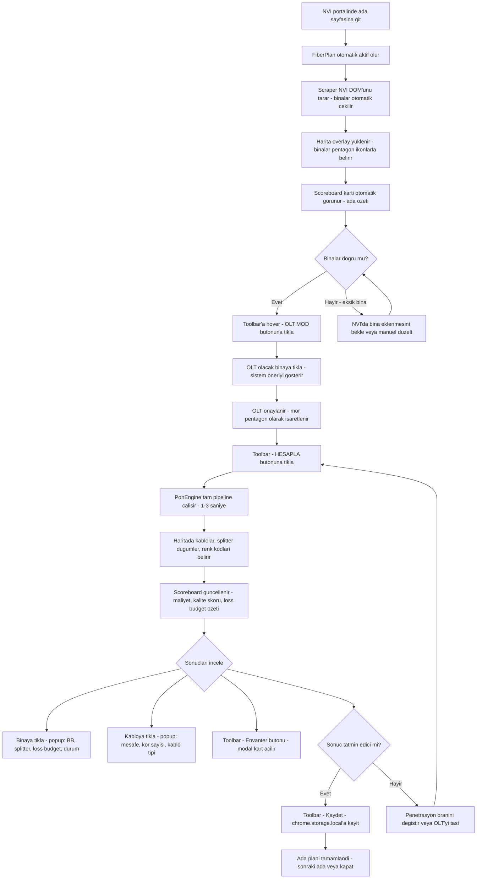
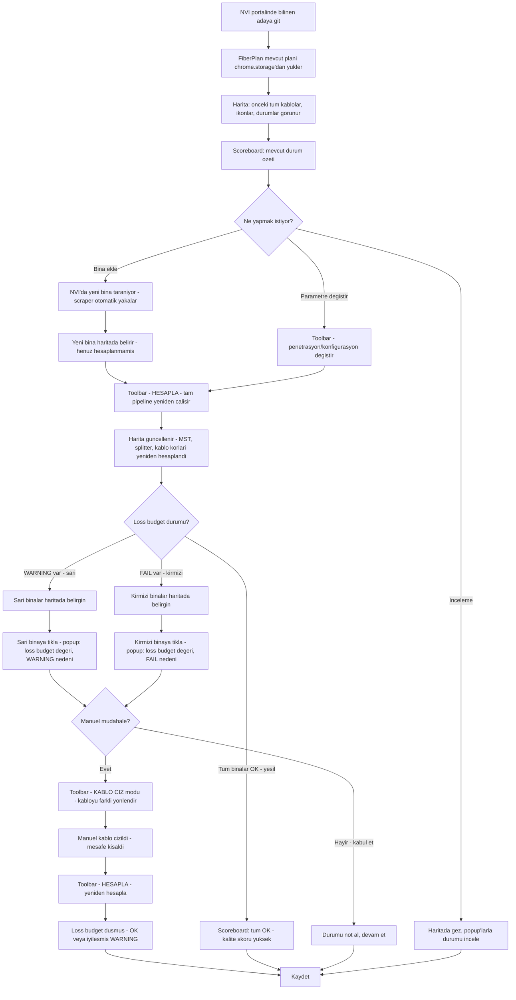
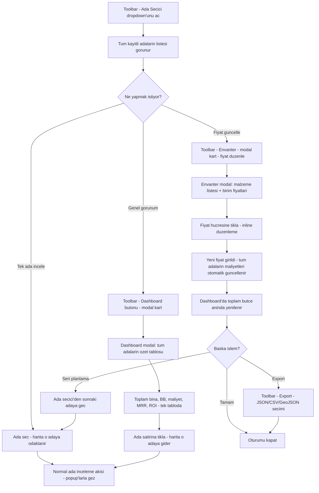

# UX Design Specification NVI FIBER

**Author:** BURAK
**Date:** 2026-02-28

---

<!-- UX design content will be appended sequentially through collaborative workflow steps -->

## Executive Summary

### Proje Vizyonu

FiberPlan, Turkiye'deki kucuk ve orta olcekli fiber ISP isletmecilerinin NVI devlet adres portali (adres.nvi.gov.tr) uzerinde FTTH fiber ag topolojisini planlamasini, maliyet hesaplamasini ve yatirim analizini tek bir Chrome Extension ile yapmasini saglayan muhendislik aracidir.

Sifir altyapi maliyetiyle (sunucu/GIS lisansi gerektirmeden) tarayici icinde calisir. NVI'nin devlet adres veritabanini dogrudan kaynak olarak kullanarak her zaman guncel veriyle islem yapar. Piyasada bu yaklasimda calisan baska bir sistem bulunmamaktadir.

### Hedef Kullanicilar

**Birincil Kullanici: ISP Isletme Sahibi & Saha Muhendisi (Burak)**
- Tek kisilik karar mercii: yatrimci, sistem yoneticisi, saha muhendisi, is gelistirme sorumlusu
- 2 kisilik operasyonel ekip
- Kullanim ortami: ofis, masaustu monitor
- Tipik oturum suresi: ~5 dakika/ada
- Birincil kullanim amaci: mevcut ada planlarini inceleme, hesaplari kontrol etme, durumu anlama
- Mevcut araclar: BTK uyumlu ISP yonetim yazilimi, Excel, kafadan hesaplama
- Temel beklenti: "Bu adada ne var, hesaplar ne diyor, durum ne?" sorusuna hizli cevap

**Ikincil Kullanici: Saha Teknisyeni**
- Burak'in onayiyla erisim
- Sahada fiber calismalari, ariza mudahale, kurulum
- Ayni yetkilerle sistemi kullanir

### Temel UX Tasarim Zorluklari

1. **Bilgi yogunlugu vs kavrama hizi:** OLT, MST, splitter, loss budget, envanter, maliyet, MRR/ROI — tumu ~5 dakikalik oturumda anlasilabilir olmali. Veri hiyerarsik ve taranabilir sunulmali.
2. **NVI portal uzerine overlay enjeksiyonu:** NVI'nin kendi DOM'u ve haritasi uzerine bagimsiz Leaflet + panel sistemi. Ekran alani paylasimi ve gorsel catisma riski yonetilmeli.
3. **Tek ekran deneyimi karmasikligi:** Planlama, envanter, finansal analiz, varyasyon — hepsi overlay panelinde. Bilgi mimarisi dogru kurulmazsa kaotik hale gelir.
4. **Brownfield gecis:** Calisan hesaplama motoru (~%60) korunacak, UI yeniden yazilacak. Mevcut kullanim aliskanliklari bozulmadan yeni deneyim sunulmali.

### Tasarim Firsatlari

1. **"Ada durumu bir bakista" deneyimi:** Ada acildiginda 5 saniyede durumu kavratacak ozet scoreboard — loss budget durumu, toplam maliyet, MRR, ada kalite skoru.
2. **Harita-merkezli bilgi kesfi:** Binaya tiklayinca detay, kabloya tiklayinca mesafe/core, OLT'ye tiklayinca port durumu — interaktif harita uzerinde kesif odakli deneyim.
3. **Hizli varyasyon karsilastirma:** Farkli penetrasyon/konfigurasyon senaryolarini yan yana gosterme, aninda gorsel fark analizi.

## Core User Experience

### Tanimlayici Deneyim

FiberPlan'in cekirdek deneyimi **harita-merkezli kesif ve anlama** uzerine kuruludur. Kullanici haritayi acar, kablolari ve binalari inceler, hangi cihazlarin gerektigini anlar. Harita sadece bir gorsellestirme araci degil, **karar verme yuzeyidir**.

Birincil kullanici akisi:
1. Ada sec → harita yuklensin
2. Kablolari ve binalari incele → cihaz ihtiyacini anla
3. Hesaplari kontrol et → kablo kor sayisi, splitter, maliyet
4. Karari ver → bu ada icin ne yapilacak net

### Platform Stratejisi

- **Platform:** Chrome Extension (Manifest V3), NVI portal uzerinde overlay
- **Giris cihazi:** Mouse/keyboard, masaustu monitor (ofis ortami)
- **Offline destek:** IndexedDB ile yerel veri depolama, internet olmadan mevcut verilerle tam islevsellik
- **Tarayici:** Sadece Google Chrome, minimum 88+
- **Kisitlar:** NVI DOM'u uzerine enjeksiyon, CSP kisitlamalari (blob URL ile tile yukleme), MAIN world injection (koordinat yakalama)

### Zahmetsiz Etkilesimler

Asagidaki islemler kullanicidan sifir dusunce gerektirmeli — tamamen otomatik calismali:

1. **Fiber bolumleme hesaplari:** Bina secildiginde splitter boyutu, kablo kor sayisi, loss budget otomatik hesaplanir
2. **Cihaz listesi olusturma:** Topoloji tanimlandiginda envanter kalemleri ve miktarlari otomatik uretilir
3. **Maliyet hesaplama:** Fiyat veya malzeme degistiginde tum maliyet hesaplamalari aninda guncellenir
4. **Yeniden hesaplama:** Bina ekleme/cikarma, OLT degistirme gibi her degisiklikte tam pipeline otomatik calisir

Kullanicinin **asla** yapmamasi gereken seyler:
- Manuel kablo kor sayisi hesaplamak
- Splitter boyutunu kendisi secmek (sistem effBB'ye gore belirler)
- Envanter kalemlerini tek tek saymak
- Loss budget'i elle hesaplamak

### Kritik Basari Anlari

**Kesinlikle dogru olmasi gereken (hata toleransi sifir):**
- Kablo kor sayilari — yanlis kor sahada maliyet felaketi demek
- Cihaz envanteri — eksik veya fazla ekipman listesi guven kirici
- Loss budget hesabi — 28 dB sinir asimi hizmet kalitesini dusurur

**"Iste tam bunu istiyordum" ani:**
Kullanici sistemi actiginda: tum maliyet hesaplari hazir, pazarlama stratejileri ve onerileri sunuluyor, ileriye donuk is gorusu var, ve gelecekte tum sistem canli olarak haritadan izlenebilir durumda. Bu an, sistemin sadece bir hesaplama araci degil, **is zekasi platformu** oldugunu hissettiren an.

### Deneyim Ilkeleri

1. **Harita merkezdir:** Her sey haritada baslar. Kablolar, binalar, cihazlar — kullanici haritaya bakarak karar verir. UI haritayi destekler, harita UI'yi degil.

2. **Hesaplamalar gorunmez ama guvenilirdir:** Kullanici hesaplama surecini gormez ama sonuclara guvenebilir. Kor sayisi, splitter, loss budget — hepsi sessizce dogru calismalidir.

3. **Veriden karara 5 dakikada:** Ada acildiginda 5 dakika icinde "bu adada ne yapmaliyim" sorusunun cevabi net olmalidir. Bilgi hiyerarsisi buna gore tasarlanir.

4. **Bugunden gelecege uzanan ekosistem:** Maliyet hesabi → pazarlama stratejisi → is gorusu → canli izleme. Her katman bir sonrakini besler, sistem kullandikca daha degerli hale gelir.

## Desired Emotional Response

### Birincil Duygusal Hedefler

**Ana duygu: "Kor ucustan net goruse gecis"**
Kullanicinin mevcut en buyuk aci noktasi veri olmadan karar vermek — mantiksal cercevesi olmayan kararlar. FiberPlan bu duyguyu tamamen tersine cevirmeli: her karar veriye dayanir, her sonuc gorunurdur.

Hedef duygusal durumlar:
1. **Verimlilik ve hiz:** Sistemi actim, 5 dakikada isim bitti. Zaman kaybettigimi hissetmiyorum.
2. **Guvenilir veri:** Gordugum rakamlara guveniyorum. Sistemi kontrol etme ihtiyaci duymuyorum cunku daha once hep dogru cikti.
3. **Kontrol hissi:** Ne oldugunu biliyorum, ne yapacagimi biliyorum. "Kor ucus" bitti.

### Duygusal Yolculuk Haritasi

**Ilk kesfettiginde:** "Bu gercekten NVI uzerinde calisiyor mu?" → saskinlik ve merak. Hemen sonuc gormek → "vay, bu ise yariyor" guveni.

**Gunluk kullanimda:** Her sabah acar, tek panelde verilerini gorur. Data akislari, sonuclar, ada durumlari — hepsi orada. Bu bir **gunluk data ritueli** haline gelmeli. "Buraya bakmadan gune baslamam" hissi.

**Hesaplama sonrasi:** Kablo korlari, splitter'lar, maliyet — hepsi otomatik. "Bunu ben hesaplasam yarim saat surerdi" → verimlilik tatmini.

**Hata durumunda:** Loss budget asildiysa, kor sayisi uyusmuyorsa — sistem sorunu gosterir, kullanici gorur, cozum uretir. "En azindan sorunu goruyorum ki ona gore cozum ureteyim" rahatligi. Panik degil, seffaflik.

**Geri donuste:** Gecmis veriler kayitli, adalar yerinde, hesaplar tutarli. "Her sey biraktigim gibi" → guvenilirlik ve sureklilik hissi.

### Mikro-Duygular

| Hedef Duygu | Karsi Duygu (Kacinilacak) | Tetikleyen UX Ani |
|-------------|--------------------------|-------------------|
| Guven | Suphe | Hesap sonuclari tutarli ve dogru |
| Verimlilik | Zaman kaybi | 5 dakikada isini bitir |
| Kontrol | Belirsizlik | Tum veriler tek panelde gorunur |
| Rahatlik | Panik | Hata durumunda sorun gorunur, cozum net |
| Aliskanlik | Zorunluluk | Her gun acmak istedigim sistem |
| Gurur | Yetersizlik | "Artik veriye dayali karar veriyorum" |

### Tasarim Etkileri

1. **Guven → Tutarli ve dogru hesaplamalar:** Rakamlar her seferinde ayni mantikla hesaplanmali. Kullanici "acaba dogru mu" diye sorgulamadan kabul edebilmeli. Hesaplama kaynagini gormek istediginde bir tik uzakta olmali.

2. **Verimlilik → Bilgi hiyerarsisi ve hizli tarama:** En onemli bilgi (ada durumu, toplam maliyet, sorunlar) ilk bakista gorunmeli. Detay sadece istendiginde acilmali.

3. **Kontrol → Tek panel, tam gorunum:** Data akislari, sonuclar, ada durumlari — dagitmadan, tek yuzeyden sunulmali. "Nerede ne var" sorusu hicbir zaman sorulmamali.

4. **Seffaflik → Gorunur hata yonetimi:** Sorunlar gizlenmez, renk kodlariyla gorsel olarak isaretlenir. WARNING sari, FAIL kirmizi — kullanici ne oldugunu aninda anlar ve mudahale edebilir.

5. **Rituel → Gunluk deger:** Sistem her acildiginda guncel, anlamli bilgi sunmali. Bos ekran veya "degisiklik yok" durumu bile bilgilendirici olmali.

### Duygusal Tasarim Ilkeleri

1. **"Kor ucus bitti" ilkesi:** Her ekranda, her panelde kullanici veriye dayali karar veriyor oldugunu hissetmeli. Belirsizlik asla UI'da yer almamali.

2. **"5 dakikada tamam" ilkesi:** Kullanici hicbir zaman sistemde kaybolmus hissetmemeli. Ne yapmasi gerektigini bilir, yapar, cikar. Verimlilik tatmini birakir.

3. **"Gorunur sorun, cozulebilir sorun" ilkesi:** Hata durumlarinda kullanici panik yerine "goruyorum, cozecegim" hissetmeli. Sorun her zaman gorsel olarak isaretli, cozum yolu belirgin.

4. **"Her gun actigim ekran" ilkesi:** Sistem zorunluluk degil aliskanlik yaratmali. Gunluk data ritueli olarak kullanicinin hayatina girip orada kalmali.

## UX Pattern Analysis & Inspiration

### Ilham Veren Urunler Analizi

**Google Earth — Birincil Ilham Kaynagi**
- **Cekirdek UX kaliplari:** Sinirsiz pan/zoom, havadan gorus, katman bazli bilgi, sezgisel navigasyon
- **Duygusal etki:** Haritada gezinmek kontrol hissi veriyor. "Surekli ustunde geziniyorum" — aliskanlik yaratan deneyim
- **Buyuk resim gorusu:** Her seyi havadan gorebilme, butuncul bakis acisi, detaya inmeden once genel durumu kavrama
- **Neden ilham verici:** FiberPlan'in harita-merkezli deneyimiyle birebir ortusuyor. Kullanici haritada gezinerek fiber agini anlayacak

**NVI Adres Portali — Mevcut Calisma Ortami**
- **Cekirdek UX kaliplari:** Adres bazli navigasyon, il/ilce/mahalle hiyerarsisi, harita + tablo entegrasyonu
- **Kullanicinin aliskanligi:** Burak zaten bu portalda surekli calisiyor, DOM yapisi ve navigasyonu icsellestirilmis
- **Neden ilham verici:** FiberPlan bu portalin UZERINDE calisiyor — mevcut aliskanlikla catismamak, onu genisletmek gerekiyor

### Aktarilabilir UX Kaliplari

**Navigasyon Kaliplari:**
- **Sinirsiz pan/zoom (Google Earth):** Harita uzerinde serbest gezinme, yakinlastikca detay artar. FiberPlan'da ada secildiginde binalar, kablolar, cihazlar gorsel olarak zenginlesir.
- **Katman bazli bilgi gosterimi:** Uydu goruntusu + kablo katmani + bina katmani + isi haritasi — kullanici istedigi katmani acar/kapatir. Google Earth'un terrain/3D/traffic katmanlari gibi.

**Etkilesim Kaliplari:**
- **Tikla-kesifet (Google Earth):** Herhangi bir noktaya tikla, bilgi karti (popup) acilsin. FiberPlan'da binaya tikla → BB, splitter, loss budget; kabloya tikla → mesafe, kor sayisi; OLT'ye tikla → port durumu.
- **Hover-onizleme:** Mouse uzerinde gezerken hafif bilgi gosterimi, tiklamadan once ne oldugunu anlama. Hizli tarama icin kritik.

**Gorsel Kaliplar:**
- **Renk kodlu durum gosterimi:** OK=yesil, WARNING=sari, FAIL=kirmizi. Haritada gezinirken sorunlu binalari/kablolari aninda gorebilme.
- **Yogunluk gorsellestirme (isi haritasi):** Google Earth'un nufus yogunlugu katmanlari gibi — potansiyel musteri yogunlugu, ariza dagilimi, penetrasyon oranlari harita uzerinde gorsel olarak.

**Vizyon Kaliplari (Gelecek):**
- **Canli izleme katmani:** Google Earth'un trafik katmani gibi — canli ag durumu harita uzerinde. Cihaz durumu, sinyal seviyeleri, ariza noktalari gercek zamanli gorunur.
- **AI simulasyon paneli:** Harita uzerinde "bu bolgeye yatirim yapsam ne olur?" senaryolari. ML ile is gelistirme, pazarlama stratejisi ve ROI tahminleri — tek panelde.

### Kacinilacak Anti-Kaliplar

1. **Form-agirlikli deneyim:** Kullanici formlara veri girmeye zorlanmamali. Google Earth'ta form yok — haritada gezinirsin, bilgi sana gelir. FiberPlan da boyle olmali.
2. **Tablo-merkezli gorunum:** Hesap sonuclarini devasa tablolarda gostermek. Bunun yerine harita uzerinde gorsel gosterim + detay icin tiklama.
3. **Coklu sayfa navigasyonu:** "Dashboard'a git, sonra envantere git, sonra haritaya don" gibi sayfa atlama. Her sey tek yuzeyden erisilebilmeli.
4. **Statik ekranlar:** Kullanici bir seyi degistirdikten sonra "yenile" butonuna basmak zorunda kalmamali. Her degisiklik aninda yansimali.

### Tasarim Ilham Stratejisi

**Benimsenmesi Gerekenler:**
- Google Earth'un sinirsiz pan/zoom ve serbest gezinme deneyimi
- Tikla-kesifet kaliplari (popup bilgi kartlari)
- Katman bazli bilgi gosterimi (acilip kapanabilen katmanlar)
- Renk kodlu durum gorsellestime (yesil/sari/kirmizi)

**Uyarlanmasi Gerekenler:**
- Google Earth'un bilgi kartlari → FiberPlan'a ozel bina/kablo/OLT detay kartlari (muhendislik verileri iceren)
- Google Earth'un katman sistemi → fiber ag katmanlari (kablo, splitter, loss budget durumu, isi haritasi)
- Haritada gezinme → ada bazli odaklanma (NVI'nin il/ilce/mahalle hiyerarsisi korunarak)

**Kacinilmasi Gerekenler:**
- Form-agirlikli veri girisi (harita-merkezli deneyimi bozar)
- Tablo-merkezli bilgi sunumu (buyuk resim kaybolur)
- Coklu sayfa navigasyonu (tek ekran ilkesini cigner)
- Manuel yenileme gerektiren statik ekranlar

**Gelecek Vizyon:**
- AI/ML ile is gelistirme senaryolari ve pazarlama onerileri
- Canli ag izleme katmani (Google Earth trafik katmani gibi)
- Simulasyon ve denemeler icin interaktif "what-if" paneli
- Tum calismalar tek panelde toplanmis, veriye dayali karar ekosistemi

## Design System Foundation

### Tasarim Sistemi Secimi

**Ozel CSS Tasarim Sistemi (Custom Design Tokens)**

FiberPlan, vanilla JavaScript + IIFE mimarisiyle calisan, NVI portali uzerine enjekte edilen bir Chrome Extension oldugu icin framework-bagli tasarim sistemleri (MUI, Chakra, Ant Design) kullanilamaz. Bunun yerine CSS custom properties uzerine kurulu, projeye ozel bir tasarim token sistemi benimsenmistir.

### Secim Gerekceleri

1. **NVI izolasyonu:** `fp-` prefix ile tum CSS degiskenleri ve sinif isimleri NVI'nin DOM'undan tamamen izole. Stil catismasi riski sifir.
2. **Vanilla JS uyumu:** Build step, bundler veya framework gerektirmez. Mevcut IIFE modul sistemiyle sorunsuz calisir.
3. **Harita-merkezli bilesenler:** Pentagon ikonlar, kablo stilleri, popup bilgi kartlari, katman kontrolleri — bunlar standart UI kit'lerde yok, zaten ozel tasarlanmak zorunda.
4. **Mevcut temeller:** MapUtils'teki renk/stil sistemi (bina tipleri, kablo stilleri) zaten bir token sisteminin cekirdegini olusturuyor.
5. **Tam kontrol:** 2 kisilik ekip icin dis bagimliliklari minimize etmek bakim yukunu azaltir.

### Uygulama Yaklasimi

**Tasarim Token Hiyerarsisi:**

Seviye 1 — Temel Tokenlar (primitive):
  `--fp-color-purple-500`, `--fp-spacing-4`, `--fp-radius-md`

Seviye 2 — Semantik Tokenlar (semantic):
  `--fp-color-ok`, `--fp-color-warning`, `--fp-color-fail`
  `--fp-color-olt`, `--fp-color-fdh`, `--fp-color-mdu-large`

Seviye 3 — Bilesen Tokenlari (component):
  `--fp-panel-bg`, `--fp-popup-border`, `--fp-toolbar-height`

**Dosya Yapisi:**
- `styles/tokens.css` — tum CSS custom properties
- `styles/base.css` — reset, tipografi, temel stiller
- `styles/components.css` — panel, popup, toolbar, bilgi karti
- `styles/map.css` — harita ozel stiller (marker, kablo, poligon)
- `styles/utilities.css` — yardimci siniflar (fp-flex, fp-grid, fp-hidden)

**Isimlendirme Kurali:**
- Tum CSS siniflari `fp-` prefix ile baslar
- BEM benzeri yapi: `fp-panel`, `fp-panel__header`, `fp-panel--collapsed`
- Durum siniflari: `fp-status--ok`, `fp-status--warning`, `fp-status--fail`

### Ozellestirme Stratejisi

**Renk Sistemi (Mevcut MapUtils'ten genisletilmis):**

| Token | Deger | Kullanim |
|-------|-------|----------|
| `--fp-color-olt` | #8B5CF6 | OLT binasi, mor |
| `--fp-color-fdh` | #3B82F6 | Splitter dugumu, mavi |
| `--fp-color-mdu-large` | #22C55E | Buyuk bina (>=20 BB), yesil |
| `--fp-color-mdu-medium` | #F97316 | Orta bina (8-19 BB), turuncu |
| `--fp-color-sfu` | #EAB308 | Kucuk bina (1-7 BB), sari |
| `--fp-color-ok` | #22C55E | Loss budget OK, yesil |
| `--fp-color-warning` | #F59E0B | Loss budget WARNING, sari |
| `--fp-color-fail` | #EF4444 | Loss budget FAIL, kirmizi |

**Tipografi:**
- Font: sistem fontlari (sans-serif) — ek font yukleme yok
- Boyutlar: `--fp-text-xs` (11px) ile `--fp-text-xl` (20px) arasi
- Panel iceriklerinde kompakt tipografi (veri yogunlugu icin)

**Bilesenler (Ozel tasarim gereken):**
- Harita popup kartlari (bina/kablo/OLT detay)
- Yan panel sistemi (sekmeli, daraltilabilir)
- Toolbar (harita modlari, ada secici)
- Scoreboard karti (ada ozeti)
- Envanter tablosu (kompakt, inline duzenlenebilir)
- Durum badge'leri (OK/WARNING/FAIL)
- Katman kontrol paneli

## 2. Core User Experience

### 2.1 Tanimlayici Deneyim

**Cekirdek Etkilesim: "Fiber agini otonom planla, canli izle, stratejik kararlar ver"**

FiberPlan'in tanimlayici deneyimi uc katmanli bir etkilesimdir:

1. **Otonom Planlama:** Kullanici fiber agini kendi basina, herhangi bir muhendislik egitimi gerektirmeden planlayabilir. Sistem bina seciminden kablo bolumlemeye, splitter hesabindan maliyet analizine kadar her seyi otomatik yapar.

2. **Canli Izleme:** Tum ag harita uzerinde canli olarak goruntulenir. Cihaz durumlari, sinyal seviyeleri, ariza noktalari — her sey tek yuzeyden izlenebilir.

3. **Stratejik Karar Verme:** Veriye dayali, olculebilir, KPI-merkezli kararlar. "Bu adaya yatirim yapayim mi?" sorusunun cevabi rakamlarda.

**Kullanicinin arkadasina anlatisi:** "Kendi fiber agimi otonom olarak planlayabiliyorum ve tum agimi her yuzeyden canli izleyebiliyorum."

### 2.2 Kullanici Zihinsel Modeli

**Mevcut Cozum (oncesi):**
- Elle hesaplama (Excel bile yok)
- Dar pencereden bakis — gecilecek firsatlar gorunmuyor
- Ongorulebilir bir yaklasim degil
- Ileriye yonelik strateji gelistirememe
- "Kor ucus" — veri olmadan karar verme

**Kullanicinin Getirdigi Zihinsel Model:**
- NVI portalinda gezinme aliskanligi (il/ilce/mahalle hiyerarsisi)
- Google Earth benzeri havadan gorus beklentisi
- "Haritada gezerim, bilgi bana gelir" beklentisi
- Tek panel, tek yuzeyde her seyi gorme istegi

**Beklenen Gecis:**
- Elle hesap → otomatik hesap (sifir dusunce)
- Dar pencere → buyuk resim gorusu (harita-merkezli)
- Anlık gorus → stratejik vizyon (KPI, ROI, pazarlama)
- Kor ucus → veriye dayali karar

### 2.3 Basari Kriterleri

**"Bu sadece calisiyor" dedirten anlar:**
1. Ada secildiginde 3 saniye icinde tum hesaplar hazir
2. Kablo kor sayisi, splitter boyutu, loss budget — hepsi otomatik ve dogru
3. Maliyet tablosu aninda gorunur, degisiklikler aninda yansir

**Kullanicinin basarili hissettigi anlar:**
1. "Bu adanin tum maliyet hesabi hazir, karari verebilirim"
2. "Sorunlu binalari haritada aninda goruyorum, mudahale edebilirim"
3. "Gecen ayla bu ayi karsilastirabiliyorum, ilerleme goruyorum"

**Basari Gostergeleri:**
- Ada inceleme suresi ≤ 5 dakika
- Sifir manuel hesaplama gerekliligi
- Ilk kullanimda egitim ihtiyaci olmadan islem yapabilme
- Gunluk tekrar kullanim (aliskanlik olusumu)

### 2.4 Yenilikci vs Yerlesik Kaliplar

**Yerlesik Kaliplar (kullanici zaten biliyor):**
- Harita uzerinde pan/zoom (Google Earth'tan asina)
- Tikla → detay gor (popup/bilgi karti)
- Renk kodlu durum gosterimi (yesil/sari/kirmizi)
- Ada bazli navigasyon (NVI portalindan asina)

**Yenilikci Kaliplar (FiberPlan'a ozgu):**
- **Harita-uzerinde-muhendislik:** Haritada bina tikla → fiber muhendislik verileri gor. Bu kalib baska urunlerde yok.
- **Otonom topoloji planlamasi:** Bina sec → sistem tum ag topolojisini olustur. Kullanici planlamiyor, sistem planliyor.
- **Tek-yuzey is zekasi:** Planlama + envanter + maliyet + KPI tek overlay panelinde. Sayfa degistirme yok.

**Yenilikci kalibin ogretilmesi:**
- Ilk kullanimda kisa onboarding: "Binaya tikla, detayini gor"
- Gorsel ipuclari: pentagon ikonlar, renk kodlari, hover bilgileri
- Asina metaforlar: Google Earth'un tikla-kesifet kalibinin muhendislik versiyonu

### 2.5 Deneyim Mekanigi

**1. Baslatma (Initiation):**
- Kullanici NVI portalinda bir adaya gider
- FiberPlan otomatik aktif olur, harita overlay yuklenir
- Ada binalari haritada gorsel olarak belirir (pentagon ikonlar)
- Scoreboard karti aninda ada ozetini gosterir

**2. Etkilesim (Interaction):**
- Haritada gezinme: pan/zoom ile binalari, kablolari incele
- Binaya tiklama: detay karti acilir (BB, splitter, loss budget)
- Kabloya tiklama: mesafe, kor sayisi, kablo tipi
- Panel uzerinden: envanter, maliyet, KPI goruntuleme
- Mod degistirme: OLT tasi, kablo ciz, sinir ciz

**3. Geri Bildirim (Feedback):**
- Renk kodlari: OK=yesil, WARNING=sari, FAIL=kirmizi — aninda gorsel geri bildirim
- Otomatik yeniden hesaplama: her degisiklik sonrasi tum pipeline calisir
- Scoreboard guncelleme: toplam maliyet, loss budget durumu, ada kalite skoru anlik guncellenir
- Hata gosterimi: sorunlu binalar/kablolar haritada kirmizi isaretlenir, panel listesinde vurgulanir

**4. Tamamlama (Completion):**
- "Bu adanin plani tamam" hissi: tum hesaplar yapilmis, envanter hazir, maliyet belli
- Export: JSON/CSV/GeoJSON olarak cikti alma
- Sonraki ada: ada secici ile baska adaya gecis
- Proje gorusu: tum adalarin toplu durumu, genel KPI'lar

## Visual Design Foundation

### Renk Sistemi

**Tema: Dark Mode (Birincil ve Tek Tema)**

FiberPlan karanlik tema uzerine kuruludur. Nedenleri:
- Harita-merkezli deneyimde koyu arka plan harita gorseline odaklanmayi arttirir
- Uydu goruntuleriyle gorsel uyum saglar (Esri World Imagery karanlik tonlarda)
- Uzun sureli ekran kullaniminda goz yorgunlugunu azaltir
- Renk kodlu durum gostergelerini (yesil/sari/kirmizi) koyu zeminde daha belirgin kilar
- Muhendislik araclarina yakin profesyonel his verir

**Arka Plan Katmanlari:**

| Token | Deger | Kullanim |
|-------|-------|----------|
| `--fp-bg-base` | #0F1117 | Ana arka plan (en derin katman) |
| `--fp-bg-surface` | #1A1D27 | Panel, kart arka planlari |
| `--fp-bg-elevated` | #242835 | Hover, aktif elemanlar, popup'lar |
| `--fp-bg-overlay` | #2E3344 | Dropdown, tooltip, modal |

**Metin Renkleri:**

| Token | Deger | Kullanim |
|-------|-------|----------|
| `--fp-text-primary` | #F0F2F5 | Ana metin, basliklar |
| `--fp-text-secondary` | #9CA3B4 | Yardimci metin, etiketler |
| `--fp-text-muted` | #5C6478 | Devre disi, placeholder |

**Durum Renkleri (dark mode icin optimize):**

| Token | Deger | Kullanim |
|-------|-------|----------|
| `--fp-color-ok` | #22C55E | Loss budget OK, basarili |
| `--fp-color-warning` | #F59E0B | Loss budget WARNING, dikkat |
| `--fp-color-fail` | #EF4444 | Loss budget FAIL, kritik |
| `--fp-color-info` | #3B82F6 | Bilgilendirme, FDH |

**Bina Tipi Renkleri (korunuyor):**
OLT=#8B5CF6, FDH=#3B82F6, MDU Large=#22C55E, MDU Medium=#F97316, SFU=#EAB308

**Sinir ve Ayirici:**

| Token | Deger | Kullanim |
|-------|-------|----------|
| `--fp-border-default` | #2E3344 | Kart sinirlari, ayiricilar |
| `--fp-border-focus` | #3B82F6 | Odaklanmis eleman |
| `--fp-border-subtle` | #1E2230 | Ince ayiricilar |

### Tipografi Sistemi

**Font:** Sistem fontlari — ek font yukleme yok, NVI portal performansini etkilemez.

**Font Stack:** `-apple-system, BlinkMacSystemFont, 'Segoe UI', Roboto, sans-serif`

**Olcek Sistemi (Kompakt):**

| Token | Boyut | Satir Yuksekligi | Kullanim |
|-------|-------|-----------------|----------|
| `--fp-text-xs` | 11px | 1.3 | Badge icerikleri, mikro etiketler |
| `--fp-text-sm` | 12px | 1.4 | Tablo satirlari, panel detaylari |
| `--fp-text-base` | 13px | 1.5 | Varsayilan govde metni |
| `--fp-text-md` | 14px | 1.4 | Panel basliklari, onemli etiketler |
| `--fp-text-lg` | 16px | 1.3 | Bolum basliklari |
| `--fp-text-xl` | 20px | 1.2 | Scoreboard rakamlari, buyuk gostergeler |

**Font Agirliklari:**
- `--fp-font-normal`: 400 — govde metni
- `--fp-font-medium`: 500 — etiketler, vurgular
- `--fp-font-semibold`: 600 — basliklar, KPI degerleri
- `--fp-font-bold`: 700 — scoreboard rakamlari, kritik degerler

**Tipografi Ilkeleri:**
- Kompakt ama okunabilir: 13px temel boyut, veri yogun panellerde 12px
- Rakamlar monospace: `font-variant-numeric: tabular-nums` — sutunlarda hizalama icin
- Buyuk rakamlar vurgulanir: maliyet, BB sayisi, loss budget degerleri `--fp-text-xl` + `--fp-font-bold`

### Bosluk ve Yerlesim Temeli

**Bosluk Olcegi (4px tabanli):**

| Token | Deger | Kullanim |
|-------|-------|----------|
| `--fp-space-1` | 4px | Ikon-metin arasi, badge ic bosluk |
| `--fp-space-2` | 8px | Bilesen ici bosluk (kompakt) |
| `--fp-space-3` | 12px | Bilesen ici bosluk (standart) |
| `--fp-space-4` | 16px | Bilesenler arasi bosluk |
| `--fp-space-5` | 20px | Bolumler arasi bosluk |
| `--fp-space-6` | 24px | Panel ic kenar bosluklari |
| `--fp-space-8` | 32px | Buyuk bolumler arasi |

**"Kompakt icerik, nefes alan yapi" ilkesi:**
- Bilesen ICinde: siki bosluk (`--fp-space-2`, `--fp-space-3`) — veri yogunlugunu korur
- Bilesenler ARAsinda: ferah bosluk (`--fp-space-4`, `--fp-space-5`) — gorsel nefes alani
- Panel kenar bosluklari: `--fp-space-6` (24px) — icerik ile cerceve arasi konfor

**Yerlesim Yapisi:**
- Ana yerlesim: Harita (tam ekran) + yan panel (sabit genislik, sagda)
- Panel genisligi: `--fp-panel-width: 360px` (daraltilabilir)
- Toolbar yuksekligi: `--fp-toolbar-height: 44px`
- Kose yuvarlagi: `--fp-radius-sm: 4px`, `--fp-radius-md: 8px`, `--fp-radius-lg: 12px`
- Grid sistemi: CSS Flexbox tabanli — panel icinde flex-column ile dikey akis

### Erisilebilirlik Hususlari

**Kontrast Oranlari (WCAG AA uyumlu):**
- Birincil metin (#F0F2F5) / Yuzey (#1A1D27) → 12.8:1 (AA ve AAA gecerli)
- Ikincil metin (#9CA3B4) / Yuzey (#1A1D27) → 5.2:1 (AA gecerli)
- OK yesil (#22C55E) / Yuzey (#1A1D27) → 6.1:1 (AA gecerli)
- Warning sari (#F59E0B) / Yuzey (#1A1D27) → 7.8:1 (AA gecerli)
- Fail kirmizi (#EF4444) / Yuzey (#1A1D27) → 4.6:1 (AA gecerli)

**Renk-bagimsiz iletisim:**
- Durum renkleri her zaman ikon veya metin ile desteklenir (sadece renk degil)
- OK=yesil+tik, WARNING=sari+ucgen, FAIL=kirmizi+carpi
- Loss budget degerlerinin yaninda her zaman sayi gosterilir

**Odak gostergeleri:**
- Tum interaktif elemanlarda `--fp-border-focus` ile belirgin odak halkasi
- Klavye navigasyonu destegi (Tab + Enter)

## Design Direction Decision

### Kesfedilen Tasarim Yonelimleri

Dort ana yerlesim yaklasimi degerlendirildi:

1. **Tam Panel:** Harita + sabit genis panel (sagda). Tum bilgiler panelde. Harita daralir.
2. **Minimal Panel:** Harita neredeyse tam ekran, daraltilabilir ince panel. Ihtiyac halinde acilir.
3. **Kayan Kartlar:** Harita tam ekran, yuzen kartlar harita ustunde. Panel yok.
4. **Coklu Sekme:** Harita + alt sekmeli bilgi paneli. Yatay bolunmus ekran.

Kayan Kartlar yaklasimi icinde uc alt-varyasyon kesfedildi:
- **A - Koseli Kartlar:** Sabit konumlarda kucuk kartlar (sol ust, sag ust, alt orta)
- **B - Kenar Bantlari:** Ust toolbar + kose kartlari, kenar bazli yerlesim
- **C - Akilli Balonlar:** Hicbir sabit UI yok, her sey tiklamadan turetilir

### Secilen Yonelim

**Akilli Balonlar (Smart Bubbles) — Tam harita-merkezli, sifir sabit UI**

Temel yaklasim:
- Harita %100 ekran kaplar, hicbir sabit panel veya toolbar harita alanini kismaz
- Tum bilgiler kullanici etkilesimiyle (tikla, hover) ortaya cikar
- Binaya tikla → muhendislik popup'u (BB, splitter, loss budget, maliyet)
- Kabloya tikla → kablo detay balonu (mesafe, kor sayisi, kablo tipi)
- OLT'ye tikla → port durumu ve kapasite balonu
- Bos alana tikla veya ada yuklendikten sonra → scoreboard ozet karti (ust orta, otomatik, 5sn sonra solen)
- Toolbar sadece harita uzerine hover yapinca ust kenarda belirir (auto-hide)
- Envanter/maliyet/KPI detaylari icin genisletilmis popup veya modal kart

**Bilesenler:**

| Bilesen | Gorunum | Tetikleme |
|---------|---------|-----------|
| Scoreboard | Ust orta, yuzen kart | Ada yuklendiginde otomatik, 5sn sonra soler |
| Bina detay | Popup balon, binaya yakin | Binaya tikla |
| Kablo detay | Popup balon, kablo uzerinde | Kabloya tikla |
| OLT detay | Popup balon, OLT'ye yakin | OLT'ye tikla |
| Toolbar | Ust kenar, tam genislik | Harita ustune hover (auto-hide) |
| Katman kontrolu | Sag ust, kucuk ikon grubu | Toolbar'dan erisim |
| Envanter/Maliyet | Modal kart, ekran ortasi | Toolbar butonundan |
| Ada secici | Toolbar icinde | Toolbar gorunurken |

### Tasarim Gerekceleri

1. **"Harita merkezdir" ilkesiyle birebir uyum:** Harita %100 gorunur, hicbir UI elemani harita alanini kalici olarak kisitlamaz. Google Earth deneyimine en yakin yaklasim.

2. **"Haritada gezerim, bilgi bana gelir" zihinsel modeliyle uyum:** Kullanici tiklar, bilgi gelir. Form doldurmaz, sayfa degistirmez, panel acmaz.

3. **Minimum gorsel kirliligi:** NVI portali uzerine enjekte edilen overlay olarak, sabit UI elemanlari ne kadar azsa NVI ile catisma riski o kadar dusuk.

4. **5 dakikalik oturum icin optimize:** Ac, haritada gez, tikla, bilgiyi gor, kapat. Panel acma/kapama, sekme degistirme gibi ekstra adimlar yok.

5. **Kompakt veri yogunlugu popup'larda:** Her popup kendi icinde kompakt (--fp-space-2), popup'lar arasi harita tamamen acik — "kompakt icerik, nefes alan yapi" ilkesi.

### Uygulama Yaklasimi

**Popup Sistemi:**
- Leaflet popup API'si kullanilarak (L.popup) ozel icerikli popup'lar
- Her popup icin ayri HTML sablonu (bina, kablo, OLT, scoreboard)
- Popup arka plani: `--fp-bg-surface` + `--fp-border-default` sinir
- Popup acilma animasyonu: fadeIn 150ms
- Tek seferde maksimum 1 detay popup'u acik (yenisi acilinca eski kapanir)

**Auto-hide Toolbar:**
- `position: fixed; top: 0` ile haritanin ustunde
- Mouse haritanin ust 60px'ine girdiginde fadeIn, ciktiginda 2sn sonra fadeOut
- Icindekiler: ada secici dropdown, mod butonlari (OLT/kablo/sinir), eylem butonlari (hesapla, export), katman toggle
- Arka plan: `--fp-bg-surface` + `backdrop-filter: blur(8px)` ile yari-seffaf

**Scoreboard Karti:**
- Ada yuklendiginde otomatik belirir (ust orta)
- 5 saniye sonra yavasce solar (fadeOut)
- Icerik: ada adi, bina sayisi, toplam BB, toplam maliyet, kalite skoru, loss budget durumu
- Tekrar gormek icin: toolbar'daki scoreboard ikonuna tikla

**Modal Kart (Envanter/Maliyet detayi):**
- Toolbar'dan "Envanter" veya "Maliyet" butonuyla acilir
- Ekranin ortasinda, `--fp-bg-surface` arka plan, `--fp-radius-lg` kose
- Haritayi %50 karartir (backdrop overlay)
- ESC veya dis tiklama ile kapanir
- Icinde: sekmeli yapi (envanter/maliyet/KPI)

## User Journey Flows

### Yolculuk 1: Yeni Ada Planlama

**Giris Noktasi:** Kullanici NVI portalinde il/ilce/mahalle/ada hiyerarsisinden bir adaya gider.

**Akis:**

**Kritik UX Anlari:**
- **Otomatik tarama:** Kullanici hicbir sey yapmadan binalar haritada belirir — "sifir dusunce" ilkesi
- **OLT secimi:** Sistem agirlikli geometrik medyanla optimal konumu onerir, kullanici onaylar veya degistirir
- **Hesaplama sonrasi:** Tum sonuclar aninda haritada gorsel — renk kodlari, kablo cizgileri, popup'lar hazir
- **Iterasyon dongusu:** Tatmin olana kadar parametre degistir - yeniden hesapla. Her dongude ~3 saniye

### Yolculuk 2: Mevcut Plan Guncelleme ve Hata Durumu

**Giris Noktasi:** Kullanici daha once planlanmis bir adaya doner.

**Akis:**

**Kritik UX Anlari:**
- **Otomatik plan yukleme:** Adaya girince onceki plan aninda gorunur — "her sey biraktigim gibi" guveni
- **Renk kodlu uyari:** Sorunlu binalar haritada aninda farkedilir — gorsel tarama ile 2 saniyede sorunlu bina bulunur
- **Popup'ta neden:** Sadece "WARNING" demek yetmez — popup'ta loss budget degeri (orn: 25.5 dB) ve sinira yakinlik gosterilir
- **Manuel mudahale dongusu:** Kablo ciz - yeniden hesapla - sonucu gor. Her dongude gorsel geri bildirim aninda

### Yolculuk 3: Operasyonel Takip ve Bolge Planlama

**Giris Noktasi:** Kullanici genel durumu gormek istiyor — tum adalar, toplam envanter, finansal gorunum.

**Akis:**

**Kritik UX Anlari:**
- **Ada listesi:** Tum adalarin mini durumu (OK/WARNING/FAIL badge) listede gorunur — hangisine bakmam lazim sorusu aninda cevaplanir
- **Dashboard modal:** Tek tabloda tum adalarin toplam gorunumu — "buyuk resim" ihtiyaci karsilanir
- **Inline fiyat duzenleme:** Fiyat degisince kaskat guncelleme — tum adalarin maliyetleri aninda yansir
- **Seri planlama:** Ada secici ile hizlica sonraki adaya gecis — ada atlama suresi < 2 saniye

### Yolculuk Kaliplari

**Navigasyon Kaliplari:**
- **Harita-merkezli gezinme:** Her yolculukta harita ana yuzeydir. Kullanici gezinerek bilgi kesfeder.
- **Ada bazli odaklanma:** Tum islemler ada kontekstinde. Ada degistirmek = kontekst degistirmek.
- **Popup-tabanli detay:** Herhangi bir elemana tikla - popup ile detay. Tutarli etkilesim kalibi.

**Karar Kaliplari:**
- **Gorsel tarama ile sorun tespiti:** Renk kodlari (yesil/sari/kirmizi) haritada - sorunlu elemani bul - tikla - detayi gor - karar ver.
- **Iteratif iyilestirme:** Parametre degistir - hesapla - sonucu gor - tatmin olana kadar tekrarla.

**Geri Bildirim Kaliplari:**
- **Aninda gorsel guncelleme:** Her hesaplama sonrasi harita ve scoreboard aninda guncellenir.
- **Durum badge'leri:** OK/WARNING/FAIL her yolculukta tutarli gorsel dil.
- **Popup ici neden gosterimi:** Sadece durum degil, neden ve deger de gosterilir.

### Akis Optimizasyon Ilkeleri

1. **Sifir adim baslatma:** Ada sayfasina git = FiberPlan otomatik aktif. Ayri baslatma adimi yok.
2. **Tek tikla kesfet:** Herhangi bir elemana tikla = bilgi gelir. Ikinci tik gerektiren hicbir bilgi yok (temel bilgiler icin).
3. **Otomatik kaskat hesaplama:** Bir sey degistiginde bagli tum hesaplamalar otomatik yenilenir.
4. **Gorsel oncelikli hata yonetimi:** Sorunlar once haritada renk koduyla gorunur, detay tiklamayla gelir.
5. **< 5 dakika kurali:** Her yolculuk 5 dakika icinde tamamlanabilir olmali.

## Component Strategy

### Tasarim Sistemi Bilesenleri

FiberPlan bir Chrome Extension overlay oldugu icin geleneksel UI framework kullanmaz. Tum bilesenler vanilla JavaScript + CSS custom properties ile olusturulur. Leaflet harita bilesenleri (L.popup, L.marker, L.control) temel alinir.

**Leaflet'ten Gelen Bilesenler:**
- L.Map — harita container
- L.Marker — bina/OLT/FDH isaretcileri (ozel pentagon ikon ile)
- L.Popup — tiklamayla acilan bilgi baloncuklari
- L.Polyline — kablo cizgileri
- L.Polygon — ada/bolge sinirlari
- L.Control — harita kontrolleri (zoom, katman toggle)

**CSS Custom Properties Sistemi:**
- Tum gorunum degerleri `--fp-` prefix'li token'larla tanimlanir
- Bilesen CSS'leri token'lara referans verir, sabit deger kullanmaz
- Tema degisikligi sadece token degerlerini degistirerek yapilir

### Ozel Bilesenler

#### 1. Pentagon Ikon (fp-pentagon-icon)

**Amac:** Bina tipini ve durumunu haritada tek bakista gosterir.
**Icerik:** SVG pentagon sekli + bina tipi rengi + opsiyonel durum badge'i.
**Eylemler:** Tikla → bina popup acar. Hover → tooltip (bina adi, BB sayisi).
**Durumlar:**
- Varsayilan: bina tipi renginde dolgulu pentagon
- Hover: parlaklik artisi (brightness 1.2) + tooltip
- Secili: etrafinda beyaz halka (stroke)
- OLT atanmis: mor (#8B5CF6) ile doldurulur
- Hata: kirmizi cember (loss budget FAIL)
- Uyari: sari cember (loss budget WARNING)
**Varyantlar:** 5 bina tipi rengi (OLT, FDH, MDU Large, MDU Medium, SFU). Boyut: 24x24px (normal), 32x32px (OLT/FDH).
**Erisilebilirlik:** `aria-label="[bina adi] - [bina tipi] - [BB sayisi] BB"`. Renk kodlari her zaman ikon ile desteklenir.

#### 2. Bina Popup Karti (fp-building-popup)

**Amac:** Tiklanmis binanin tum muhendislik detaylarini kompakt popup'ta gosterir.
**Icerik:** Bina adi, adres, BB sayisi, splitter boyutu, loss budget degeri + durum, kablo mesafesi, maliyet ozeti.
**Eylemler:** Kapat (X), OLT ata/kaldir butonu, detay genislet (modal'a gec).
**Durumlar:**
- Varsayilan: `--fp-bg-surface` arka plan, normal icerik
- Loss OK: loss budget degeri yesil badge ile
- Loss WARNING: loss budget degeri sari badge ile, uyari mesaji
- Loss FAIL: loss budget degeri kirmizi badge ile, hata mesaji
- OLT bina: ek olarak port sayisi, kapasite bilgisi gosterilir
**Varyantlar:** Kompakt (temel bilgiler), Genisletilmis (tam detay — modal'da acilir).
**Erisilebilirlik:** `role="dialog"`, `aria-label="Bina detay: [bina adi]"`. Tab ile alan gezinme. ESC ile kapatma.

#### 3. Kablo Popup Karti (fp-cable-popup)

**Amac:** Tiklanmis kablonun teknik detaylarini gosterir.
**Icerik:** Kablo tipi (feeder/distribution/drop/ring), mesafe (metre), kor sayisi, fiber kaybi (dB), baslangic-bitis binalari.
**Eylemler:** Kapat (X).
**Durumlar:**
- Varsayilan: kablo tipi renginde baslik + detay bilgileri
- Manuel kablo: "Manuel" badge + farkli arka plan tonu
**Varyantlar:** Tek varyant.
**Erisilebilirlik:** `role="dialog"`, `aria-label="Kablo detay: [baslangic] - [bitis]"`.

#### 4. OLT Popup Karti (fp-olt-popup)

**Amac:** OLT binasinin kapasite ve port durumunu gosterir.
**Icerik:** OLT bina adi, toplam port sayisi, kullanilan portlar, bagli bina sayisi, toplam BB, kapasite yuzdeligi.
**Eylemler:** Kapat (X), OLT tasi (surukleme moduna gec).
**Durumlar:**
- Normal: kapasite bar yesil
- Yuksek kapasite: kapasite bar sari (>%70)
- Kapasite asildi: kapasite bar kirmizi (>%90)
**Varyantlar:** Tek varyant.
**Erisilebilirlik:** `role="dialog"`, kapasite degeri metin olarak da belirtilir.

#### 5. Scoreboard Karti (fp-scoreboard)

**Amac:** Ada yuklendiginde genel durumu ozet olarak gosterir.
**Icerik:** Ada adi, bina sayisi, toplam BB, toplam maliyet, kalite skoru (yuzde), loss budget genel durumu (OK/WARNING/FAIL sayilari).
**Eylemler:** Tekrar goster (toolbar'dan). Tikla → Dashboard modal'a git.
**Durumlar:**
- Gorunur: fadeIn animasyonu ile belirir
- Otomatik sonen: 5 saniye sonra fadeOut
- Gizli: gorsel yok
**Varyantlar:** Kompakt (varsayilan), Genisletilmis (detayli — toolbar'dan acildiginda).
**Erisilebilirlik:** `role="status"`, `aria-live="polite"` — icerik degistiginde ekran okuyucu bildirir.

#### 6. Auto-hide Toolbar (fp-toolbar)

**Amac:** Harita modlarini, eylem butonlarini ve navigasyonu saglar. Harita alanini kisitlamadan.
**Icerik:** Ada secici dropdown, mod butonlari (OLT/Kablo Ciz/Sinir Ciz), eylem butonlari (Hesapla, Kaydet, Export), katman toggle, scoreboard ikonu.
**Eylemler:** Her buton kendi islemini baslatir. Ada secici ada degistirir.
**Durumlar:**
- Gizli: toolbar gorsel yok (varsayilan)
- Gorunur: mouse haritanin ust 60px'ine girdiginde fadeIn
- Aktif mod: secili mod butonu vurgulanir (--fp-color-info arka plan)
- Hover'dan cikis: 2 saniye sonra fadeOut
**Varyantlar:** Tek varyant.
**Erisilebilirlik:** `role="toolbar"`, `aria-label="FiberPlan araclar"`. Klavye erisilebilirligi: F2 ile toolbar'u ac/kapat.

#### 7. Ada Secici (fp-ada-selector)

**Amac:** Kayitli adalar arasinda hizlica gecis saglar.
**Icerik:** Dropdown listesi — her ada icin: ada adi, bina sayisi, durum badge'i (OK/WARNING/FAIL).
**Eylemler:** Ada sec → harita o adaya odaklanir, veriler yuklenir.
**Durumlar:**
- Kapali: sadece aktif ada adi gorunur
- Acik: dropdown listesi ile tum adalar
- Bos: "Henuz ada yok" mesaji
**Varyantlar:** Tek varyant, toolbar icinde konumlanir.
**Erisilebilirlik:** `role="combobox"`, ok tuslari ile gezinme, Enter ile secim.

#### 8. Modal Kart (fp-modal)

**Amac:** Detayli envanter, maliyet ve KPI bilgilerini buyuk formatta gosterir.
**Icerik:** Sekmeli yapi — Envanter (malzeme listesi + adetler), Maliyet (birim fiyat × adet), KPI (performans gostergeleri).
**Eylemler:** Sekme degistir, fiyat duzenleme (inline), kapat (ESC veya dis tikla), export.
**Durumlar:**
- Acik: modal gorunur, arka plan %50 karartilir
- Kapali: modal gizli
- Duzenleme: fiyat hucresi edit modunda
**Varyantlar:** Envanter modu, Maliyet modu, KPI modu (sekmeli).
**Erisilebilirlik:** `role="dialog"`, `aria-modal="true"`. Odak kilidi (modal icinde Tab dongusu). ESC ile kapatma.

#### 9. Dashboard Modal (fp-dashboard)

**Amac:** Tum adalarin toplu durumunu tek tabloda gosterir.
**Icerik:** Ada listesi tablosu — ada adi, bina sayisi, BB, maliyet, MRR, ROI, durum. Alt kisimda toplamlar satiri.
**Eylemler:** Ada satirina tikla → harita o adaya gider. Siralama (sutun basligina tikla). Export.
**Durumlar:**
- Acik: modal gorunur, tablo yuklenmis
- Bos: "Henuz planlanmis ada yok" mesaji
**Varyantlar:** Tek varyant.
**Erisilebilirlik:** `role="dialog"`, tablo icin `role="grid"`, ok tuslari ile hucre gezinme.

#### 10. Durum Badge (fp-status-badge)

**Amac:** OK/WARNING/FAIL durumunu kompakt gorsel olarak gosterir.
**Icerik:** Durum ikonu + durum metni + opsiyonel deger.
**Eylemler:** Yok (salt okunur gosterge).
**Durumlar:**
- OK: yesil arka plan + tik ikonu + "OK" metni
- WARNING: sari arka plan + ucgen ikonu + "WARNING" metni
- FAIL: kirmizi arka plan + carpi ikonu + "FAIL" metni
**Varyantlar:** Kucuk (popup icinde), Normal (tablo icinde), Buyuk (scoreboard icinde).
**Erisilebilirlik:** `role="status"`, `aria-label="Durum: [OK/WARNING/FAIL]"`. Renk + ikon + metin uc katmanli iletisim.

### Bilesen Uygulama Stratejisi

**Genel Yaklasim:**
- Tum bilesenler vanilla JavaScript + CSS custom properties ile olusturulur
- Hicbir framework, hicbir build step
- CSS sinif adi: `fp-[bilesen-adi]` prefix (ornek: `fp-toolbar`, `fp-popup-building`)
- Bilesenler `--fp-` token'larina referans verir
- Harita bilesenleri Leaflet API'si uzerinden (L.popup, L.marker, L.control)
- DOM bilesenleri template literal ile olusturulur (`innerHTML` ile)
- Durum yonetimi: basit JavaScript degiskenleri (state objesi)

**Bilesen-Modul Eslesmesi:**

| Bilesen | Sorumlu Modul | Notlar |
|---------|---------------|--------|
| Pentagon Ikon | MapUtils.js | SVG uretici fonksiyon |
| Bina Popup | Overlay.js | L.popup + ozel HTML |
| Kablo Popup | Overlay.js | L.popup + ozel HTML |
| OLT Popup | Overlay.js | L.popup + ozel HTML |
| Scoreboard | Overlay.js | L.control + CSS animasyon |
| Auto-hide Toolbar | Panels.js | DOM eleman + mouseover/mouseout |
| Ada Secici | Panels.js | Dropdown bilesen |
| Modal Kart | Panels.js | DOM eleman + backdrop |
| Dashboard Modal | Panels.js veya dashboard.js | Tam sayfa CRM icin dashboard.js |
| Durum Badge | MapUtils.js | Yeniden kullanilabilir HTML uretici |

### Uygulama Yol Haritasi

**Faz 1 — Cekirdek Bilesenler (Temel Islevsellik):**
- Pentagon Ikon — haritada bina gosterimi icin zorunlu
- Bina Popup — "tikla-kesfet" deneyiminin temeli
- Scoreboard — ada yuklendiginde ilk gorsel geri bildirim
- Durum Badge — tum bilesenler icinde yeniden kullanilan temel parca

**Faz 2 — Etkilesim Bilesenleri (Tam Deneyim):**
- Auto-hide Toolbar — mod degistirme ve eylem butonlari
- Ada Secici — adalar arasi navigasyon
- Kablo Popup — kablo detay inceleme
- OLT Popup — kapasite izleme

**Faz 3 — Ileri Bilesenler (Operasyonel Yonetim):**
- Modal Kart — envanter/maliyet detayli gorunum
- Dashboard Modal — coklu ada yonetimi ve genel gorunum

## UX Tutarlilik Kaliplari

### Popup Etkilesim Kaliplari

**Temel Kural: "Tek tikla kesfet, tek popup acik"**

**Acilma Davranisi:**
- Harita elemanina (bina/kablo/OLT) tikla → popup o elemanin yakininda acilir
- Yeni popup acildiginda onceki popup otomatik kapanir (tek seferde 1 popup)
- Popup acilma: `fadeIn 150ms ease-out`
- Popup kapanma: `fadeOut 100ms ease-in`

**Popup Icerik Hiyerarsisi (tum popup'larda tutarli):**
1. **Baslik satiri:** Eleman adi + durum badge (sag ust) + kapat butonu (X)
2. **Ana metrik bloku:** En onemli 2-3 sayi buyuk font ile (`--fp-text-xl`, `--fp-font-bold`)
3. **Detay satirlari:** Etiket: Deger formati, `--fp-text-sm` ile kompakt
4. **Eylem butonu (varsa):** Popup altinda, tek birincil eylem

**Konum Kurallari:**
- Popup, tiklanilan elemanin ustunde acilir (Leaflet varsayilani)
- Ekran kenarinda ise otomatik yon degistirir (Leaflet `autoPan: true`)
- Popup ile eleman arasinda ok (tip) isaretcisi

**Kapatma Yontemleri:**
- Popup icerideki X butonuna tikla
- Haritada bos alana tikla
- Baska bir elemana tikla (yeni popup acar, eskiyi kapatir)
- ESC tusu

**Erisilebilirlik:**
- Her popup `role="dialog"` + `aria-label`
- Acildiginda odak popup'a gider
- Tab ile icerik alanlarinda gezinme
- ESC ile kapatma

### Durum Geri Bildirim Kaliplari

**Temel Kural: "Renk + ikon + metin = uc katmanli iletisim"**

**Durum Gorsel Dili (tum bilesenler icin tutarli):**

| Durum | Renk | Ikon | Metin | Token |
|-------|------|------|-------|-------|
| OK | `--fp-color-ok` (#22C55E) | ✓ (tik) | "OK" | Yesil zemin |
| WARNING | `--fp-color-warning` (#F59E0B) | ▲ (ucgen) | "WARNING" | Sari zemin |
| FAIL | `--fp-color-fail` (#EF4444) | ✕ (carpi) | "FAIL" | Kirmizi zemin |
| INFO | `--fp-color-info` (#3B82F6) | ℹ (bilgi) | baglama gore | Mavi zemin |

**Uygulama Yerleri:**
- Pentagon ikon cemberi (haritada bina durumu)
- Popup icerideki badge (loss budget sonucu)
- Scoreboard karti (ada genel durumu)
- Ada secici listesi (ada durumu)
- Dashboard tablosu (ada satir durumu)

**Animasyon Kaliplari:**
- Durum degisimi: eski renk → yeni renk `transition 300ms`
- Yeni hesaplama sonrasi: kisa parlama efekti (`pulse 500ms`) dikkat cekmek icin
- Scoreboard guncelleme: rakam degisiminde kisa vurgulama

**Sayi + Durum Birlesimi:**
- Loss budget degeri her zaman gosterilir: "23.5 dB ✓ OK" veya "26.8 dB ▲ WARNING"
- Sadece renk/ikon yetmez — sayi baglam verir

### Harita Mod Kaliplari

**Temel Kural: "Tek aktif mod, belirgin gosterge, kolay cikis"**

**Mod Listesi:**
- **Normal mod:** Varsayilan. Tikla-kesfet, popup ac, haritada gez.
- **OLT mod:** OLT atamak icin binaya tikla.
- **Kablo Ciz mod:** Manuel kablo cizmek icin haritada noktalar tikla.
- **Sinir Ciz mod:** Ada/bolge siniri cizmek icin poligon ciz.

**Mod Gecis Davranisi:**
- Toolbar'dan mod butonuna tikla → o mod aktif olur
- Aktif mod butonu vurgulanir: `--fp-color-info` arka plan + beyaz metin
- Diger mod butonlari normal gorunumde kalir
- Mod aktifken harita imleci degisir (crosshair veya ozel imlec)

**Mod Iptal Etme:**
- Ayni mod butonuna tekrar tikla → normal moda don
- ESC tusu → normal moda don
- Baska bir mod butonuna tikla → o moda gec

**Mod Icinde Geri Bildirim:**
- OLT mod: tiklanilan binada "OLT olarak ata?" onay popup'u
- Kablo Ciz mod: tiklanilan noktalar arasinda canli cizgi onizlemesi
- Sinir Ciz mod: tiklanilan noktalar arasinda canli poligon onizlemesi
- Her mod icin ust bilgi cizgisi: "[Mod adi] aktif — islemi tamamlayinca ESC ile cikin"

### Hesaplama ve Yukleme Kaliplari

**Temel Kural: "Otomatik kaskat, aninda gorsel guncelleme"**

**Hesaplama Tetikleme:**
- HESAPLA butonu tiklandiginda → tam PonEngine pipeline calisir
- Otomatik tetikleme: OLT atandiginda, bina eklendiginde/cikarildiginda
- Manuel modda: sadece HESAPLA butonuyla tetiklenir

**Hesaplama Sirasinda Geri Bildirim:**
- Hesaplama suresi < 3 saniye → yukleme gostergesi gerekmez, sonuc aninda belirir
- Eger > 1 saniye surerse: scoreboard'da kucuk spinner (donen halka) gosterilir
- Harita elemanlarinda gecici soldurma (opacity 0.5) → hesaplama bitti → tam opaklik

**Hesaplama Sonrasi Guncelleme Sirasi:**
1. Harita cizgileri (kablolar) guncellenir
2. Pentagon ikonlar duruma gore renklenir
3. Scoreboard rakamlari guncellenir (kisa vurgulama animasyonu)
4. Acik popup varsa icerigi yenilenir

**Bos Durumlar:**
- Ada henuz yuklenmemis: harita bos, ortada "NVI portalinde bir ada sayfasina gidin" mesaji
- Ada yuklenmis ama hesaplama yapilmamis: binalar gorunur, kablolar yok, scoreboard'da "Hesaplama bekleniyor" mesaji
- Hicbir ada kayitli degil: ada secici'de "Henuz kayitli ada yok" mesaji

**Hata Durumlari:**
- Pipeline hatasi: scoreboard'da kirmizi banner "Hesaplama hatasi — tekrar deneyin"
- Veri kaybi: "Veriler yuklenemedi — sayfa yenileyin" mesaji harita ortasinda
- Hata mesajlari 5 saniye gorunur, sonra solar (ama tekrar gosterilebilir)

### Toolbar ve Navigasyon Kaliplari

**Temel Kural: "Haritayi kisitlama, ihtiyac halinde gorun"**

**Auto-hide Davranisi:**
- Varsayilan: toolbar gizli
- Mouse haritanin ust 60px'ine girdiginde: `fadeIn 200ms`
- Mouse toolbar'dan ayrildiginda: 2 saniye bekle → `fadeOut 300ms`
- Mod aktifken (OLT/Kablo/Sinir): toolbar surekli gorunur (mod bilgisi icin)
- Klavye kisayolu: F2 ile toolbar'u ac/kapat (toggle)

**Buton Hiyerarsisi:**

| Oncelik | Gorunum | Ornek |
|---------|---------|-------|
| Birincil | Dolgulu, `--fp-color-info` arka plan, beyaz metin | HESAPLA, Kaydet |
| Ikincil | Cizgili, `--fp-border-default` sinir, `--fp-text-primary` metin | Export, Envanter |
| Mod butonu | Normal: `--fp-bg-elevated`. Aktif: `--fp-color-info` | OLT, Kablo Ciz, Sinir Ciz |
| Ikon butonu | Sadece ikon, hover'da tooltip | Katman toggle, Scoreboard |

**Buton Durumlari (tum butonlar icin tutarli):**
- Varsayilan: normal gorunum
- Hover: `--fp-bg-elevated` arka plan + brightness(1.1)
- Aktif/Basili: `--fp-bg-overlay` arka plan + olcek kuculme (scale 0.97)
- Devre disi: opacity 0.4, tiklanamaz
- Odak: `--fp-border-focus` halkasi (2px)

**Ada Navigasyonu:**
- Ada secici dropdown: toolbar icinde, sol tarafta
- Aktif ada adi gorunur, tikla → dropdown acilir
- Her ada satirinda: ada adi + bina sayisi + durum badge
- Ada sec → harita o adanin koordinatlarina pan/zoom yapar, veriler yuklenir
- Gecis suresi hedefi: < 2 saniye

### Modal ve Overlay Kaliplari

**Temel Kural: "Odakli icerik, kolay cikis, harita arkada"**

**Modal Acma:**
- Toolbar'dan buton ile (Envanter, Dashboard)
- Popup'tan "Detay" butonu ile (bina popup → genisletilmis detay)
- Acilma animasyonu: backdrop `fadeIn 200ms` + modal `slideUp 200ms + fadeIn 200ms`

**Modal Gorunum:**
- Pozisyon: ekran ortasi, dikey ve yatay ortali
- Boyut: genislik max 640px, yukseklik max %80 viewport
- Arka plan: `--fp-bg-surface` + `--fp-radius-lg` (12px) kose
- Backdrop: haritayi %50 karartir (`rgba(0,0,0,0.5)`)
- Golge: `0 8px 32px rgba(0,0,0,0.4)`

**Modal Kapatma:**
- X butonu (sag ust)
- ESC tusu
- Backdrop'a tikla (dis alan)
- Kapanma animasyonu: modal `fadeOut 150ms` + backdrop `fadeOut 150ms`

**Sekmeli Icerik (Modal Kart icinde):**
- Sekme basliklari modal ust kenarinda, yatay
- Aktif sekme: alt cizgi (`--fp-color-info`, 2px)
- Sekme degistirme: icerik aninda degisir (animasyonsuz — hiz oncelikli)

**Odak Yonetimi:**
- Modal acildiginda odak modal'a gider
- Tab dongusu modal icinde kalir (disari cikmaz)
- Kapandiginda odak modal'i acan elemana doner

**Inline Duzenleme (Modal icinde):**
- Fiyat hucresi: tikla → input'a donusur
- Input odaklandiginda: `--fp-border-focus` sinir
- Enter → kaydet + sonraki hucreye gec
- ESC → iptal + eski deger
- Kaydedildiginde: hucre kisa yesil parlama (basarili geri bildirim)

## Duyarli Tasarim ve Erisilebilirlik

### Duyarli Tasarim Stratejisi

**Platform: Sadece Masaustu Chrome Tarayicisi**

FiberPlan bir Chrome Extension olarak sadece masaustu Chrome'da calisir. Mobil ve tablet destegi kapsam disindadir. Duyarli tasarim stratejisi farkli masaustu ekran boyutlarina uyum saglamaya odaklanir.

**Desteklenen Ekran Boyutlari:**

| Kategori | Genislik Araligi | Tipik Cihaz | Kullanim |
|----------|-----------------|-------------|----------|
| Kompakt masaustu | 1280px - 1439px | 13-14" dizustu | Saha muhendisi dizustu |
| Standart masaustu | 1440px - 1919px | 15-17" dizustu / 22" monitor | Ofis kullanimi |
| Genis masaustu | 1920px+ | 24"+ monitor | Detayli planlama |

**Uyum Stratejisi:**

FiberPlan harita-merkezli ve Akilli Balonlar tasarim yonelimiyle calisir — sabit panel veya sidebar yok. Bu nedenle geleneksel breakpoint sistemi yerine **esnek bilesen olcekleme** yaklasimiyla uyum saglanir:

- **Harita:** Her zaman %100 viewport kaplar — ekran boyutundan bagimsiz
- **Popup'lar:** Sabit genislik (max 320px), ekran kenarinda otomatik yon degistirir (Leaflet autoPan)
- **Modal kartlar:** `max-width: 640px` + `max-height: 80vh` — buyuk ekranlarda ortali, kucuk ekranlarda kenarlara yakin
- **Toolbar:** `width: 100%` ile tam genislik, icerik yatay overflow durumunda kaydirilabilir
- **Scoreboard:** Sabit genislik (max 400px), ust ortada konumlanir

**Kucuk Ekran Uyumlari (< 1440px):**
- Modal kart genisligi `max-width: 90vw`'ye duser (640px yerine)
- Popup icerik yogunlugu ayni kalir (zaten kompakt)
- Toolbar butonlari: metin etiketleri gizlenir, sadece ikonlar kalir (hover'da tooltip)
- Dashboard tablosu: yatay kaydirma aktif olur (tum sutunlar korunur)

**Buyuk Ekran Uyumlari (> 1920px):**
- Harita alani genisler (zaten %100)
- Popup ve modal boyutlari sabit kalir — gereksiz buyume yok
- Pentagon ikon boyutu artmaz (24/32px yeterli)
- Daha fazla bina ayni anda gorunur — harita zoom seviyesi kullaniciya birakilir

### NVI Portal Uyumu

**Overlay Yerlestirme Stratejisi:**

FiberPlan, NVI portalinin DOM'u uzerine enjekte edilir. NVI'nin kendi sayfa yapisiyla catismamak icin:

- Tum FiberPlan elemanlari `z-index` hiyerarsisi ile NVI elemanlarinin ustunde
- `z-index` degerleri: Harita=1000, Popup=1100, Toolbar=1200, Modal=1300, Backdrop=1250
- FiberPlan CSS'leri `fp-` prefix ile NVI CSS'leriyle catisma onlenir
- NVI portalinin farkli sayfa genislikleri (ada sayfasi vs. il sayfasi) overlay'i etkilemez — harita her zaman sabit konumda

**NVI Sayfa Yapisi Degisiklikleri:**
- Scraper NVI DOM degisikliklerini 1 saniye aralikla izler
- NVI sayfa yapisi degisirse (versiyon guncelleme) scraper selector'ler guncellenir
- Overlay haritasinin konumu NVI'dan bagimsizdir — NVI degisse bile harita calisir

### Erisilebilirlik Stratejisi

**Hedef: WCAG 2.1 AA Uyumu**

FiberPlan profesyonel bir muhendislik araci olarak WCAG AA seviyesini hedefler. AAA gereksizdir cunku hedef kitle teknik profesyonellerdir ve urun gorsel-yogun harita deneyimidir.

**Renk ve Kontrast (Step 8'den devam):**
- Tum metin/arka plan kombinasyonlari WCAG AA kontrast oranlarini karsilar (minimum 4.5:1)
- Durum bilgileri sadece renge dayanmaz: renk + ikon + metin uc katmani
- Loss budget degerleri her zaman sayi olarak gosterilir (sadece renk degil)

**Klavye Navigasyonu:**

| Islem | Klavye Kisayolu |
|-------|----------------|
| Toolbar ac/kapat | F2 |
| Popup kapat | ESC |
| Modal kapat | ESC |
| Mod iptal | ESC |
| Toolbar butonlari arasi | Tab / Shift+Tab |
| Dropdown gezinme | Yukari/Asagi ok tuslari |
| Dropdown secim | Enter |
| Modal icinde gezinme | Tab (dongu icinde) |
| Inline duzenleme kaydet | Enter |
| Inline duzenleme iptal | ESC |

**Klavye Navigasyon Sirasi (Tab order):**
1. Toolbar butonlari (soldan saga)
2. Ada secici dropdown
3. Popup icerideki alanlar (aciksa)
4. Modal icerideki alanlar (aciksa — odak kilidi)

**Odak Yonetimi Kurallari:**
- Popup acildiginda: odak popup'a gider
- Popup kapandiginda: odak tiklanilan harita elemanina doner
- Modal acildiginda: odak modal'a gider, Tab dongusu modal icinde kalir
- Modal kapandiginda: odak modal'i acan butona doner
- Tum odaklanabilir elemanlarda: `--fp-border-focus` (2px #3B82F6) halkasi

**Ekran Okuyucu Destegi:**

| Bilesen | ARIA Rolu | Canli Bolge |
|---------|-----------|-------------|
| Popup | `role="dialog"` + `aria-label` | Hayir |
| Modal | `role="dialog"` + `aria-modal="true"` | Hayir |
| Toolbar | `role="toolbar"` + `aria-label` | Hayir |
| Scoreboard | `role="status"` | `aria-live="polite"` |
| Durum Badge | `role="status"` + `aria-label` | Hayir |
| Ada Secici | `role="combobox"` | Hayir |
| Dashboard Tablosu | `role="grid"` | Hayir |

**Canli Bolge (aria-live) Kullanimi:**
- Scoreboard: `aria-live="polite"` — hesaplama sonrasi guncelleme ekran okuyucuya bildirilir
- Hata mesajlari: `aria-live="assertive"` — kritik hatalar aninda okunur
- Diger bilesenler: canli bolge kullanmaz (gereksiz gurultu onlenir)

**Harita Erisilebilirligi:**
- Harita dogasi geregi gorsel-agirlikli bir bilesendir — tam ekran okuyucu destegi pratik degildir
- Pentagon ikonlara `aria-label` atanir (bina adi + tip + BB)
- Harita zoom kontrolleri klavye ile erisilebilir (+/- tuslari)
- Harita etkilesimleri (pan/zoom) fare ve trackpad ile — klavye alternatifi toolbar uzerinden ada secici ile saglanir

### Test Stratejisi

**Ekran Boyutu Testi:**
- 1280px (13" dizustu) — minimum desteklenen genislik
- 1440px (standart dizustu) — birincil hedef
- 1920px (tam HD monitor) — ikincil hedef
- Chrome DevTools Device Toolbar ile test edilir

**Erisilebilirlik Testi:**
- Chrome DevTools Lighthouse erisilebilirlik denetimi (hedef skor: 90+)
- Tab ile tum etkilesim noktalarinda gezinme testi
- ESC ile tum kapatma islemlerinin calismasi
- Kontrast oranlarinin Chrome DevTools ile dogrulanmasi
- `aria-label` ve `role` atamalarinin eksiksizligi

**NVI Uyumluluk Testi:**
- NVI portalinin farkli sayfalarinda (il, ilce, mahalle, ada) overlay calisma testi
- NVI DOM degisiklikleri sonrasi scraper calismasi testi
- z-index catisma testi (NVI dropdown/modal vs FiberPlan elemanlari)

### Uygulama Yonergeleri

**CSS Yaklasimlari:**
- Sabit piksel yerine esnek birimler: popup genislikleri `max-width` ile sinirlanir
- Modal boyutlari: `max-width` + `max-height` + viewport yuzdeleri
- Font boyutlari: px ile tanimlanir (Chrome Extension overlay — kullanici ayari gerekli degil)
- Bosluklar: CSS custom property token'lari ile (`--fp-space-*`)

**JavaScript Yaklasimlari:**
- Odak yonetimi: `document.activeElement` takibi, `focus()` ve `blur()` cagrimi
- Klavye olaylari: `keydown` dinleyici ile ESC, Tab, Enter, ok tuslari
- ARIA: `setAttribute('aria-label', ...)` ile dinamik etiketleme
- Tab kilidi (modal icinde): ilk ve son odaklanabilir eleman arasinda dongu

**NVI Uyumu:**
- Tum CSS siniflari `fp-` prefix ile (NVI catisma onleme)
- Tum DOM elemanlari `data-fiberplan` attribute ile isaretlenir (kolay temizlik)
- z-index 1000+ araliginda (NVI'nin z-index degerleri genellikle < 100)
